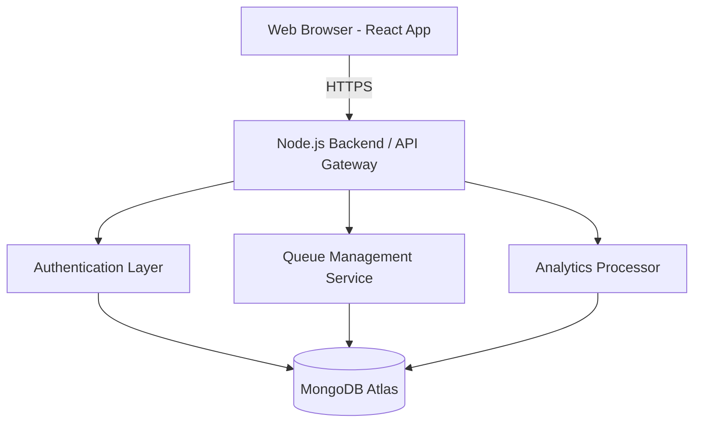

# QueueLess Cloud-Native Architecture

## System Overview
QueueLess is built as a highly scalable, cloud-native application using a MERN stack (MongoDB, Express, React, Node.js). It is containerized using Docker and deployed via Jenkins CI/CD.

## High-Level Data Flow

## DevOps Architecture

### 1. Source Control
All application source code (Client + Server codebases) is hosted in **Bitbucket**. 

### 2. CI/CD Pipeline (Jenkins)
A Jenkins pipeline triggers on push events to Bitbucket `main`:
1. **Checkout**: Pulls the latest stable code.
2. **Build & Test**: Installs dependencies and runs suite tests.
3. **Containerization**: Using `docker-compose`, it constructs the `queueless_frontend` (Nginx + React) and `queueless_backend` (Node.js) images.
4. **Deploy**: The `docker-compose up -d` command restarts the containers locally or on the target EC2/cloud server ensuring zero-downtime updates.

### 3. Container Topology
- **queueless_frontend**: Serves optimized static assets over port 80 utilizing Nginx alpine.
- **queueless_backend**: Express API utilizing Node.js 20 on Alpine for a minimal footprint. Exposed internally to the stack.
- **mongodb**: While local development utilizes a containerized DB, production utilizes **MongoDB Atlas** for managed replication, sharding, and dedicated backups.

## Security Posture
- **Edge Security**: `helmet` manages strict HTTP headers.
- **DDoS Mitigation**: `express-rate-limit` governs API request caps.
- **Authentication**: Stateless stateless JWT with hashed credentials (`bcrypt`).
